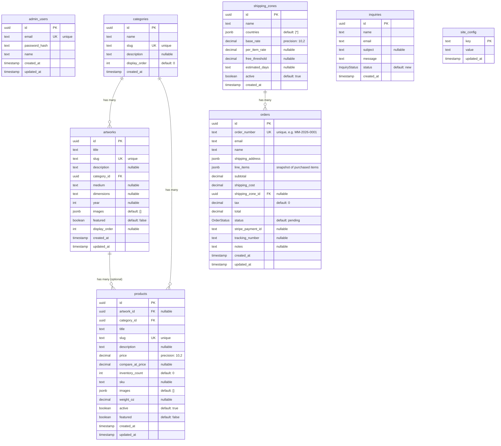

# Database Entity Relationship Diagram

## Visual Diagram



## Enums

### OrderStatus
```
pending → paid → shipped → delivered
              ↘ cancelled
```

| Value | Description |
|-------|-------------|
| `pending` | Order created, awaiting payment |
| `paid` | Payment received via Stripe |
| `shipped` | Order shipped, tracking number added |
| `delivered` | Order delivered to customer |
| `cancelled` | Order cancelled (refunded or abandoned) |

### InquiryStatus

| Value | Description |
|-------|-------------|
| `new` | Unread inquiry |
| `read` | Admin has viewed |
| `replied` | Admin has responded |

## Relationship Details

### Category → Artwork (One-to-Many)
- Every artwork **must** belong to one category
- Deleting a category is blocked if artworks exist (`ON DELETE RESTRICT`)

### Category → Product (One-to-Many)
- Every product **must** belong to one category
- Deleting a category is blocked if products exist (`ON DELETE RESTRICT`)

### Artwork → Product (One-to-Many, Optional)
- A product **may** be linked to an artwork (e.g., prints of an original)
- Products can also be standalone (merchandise, etc.)
- If artwork is deleted, product's `artwork_id` is set to NULL (`ON DELETE SET NULL`)

### ShippingZone → Order (One-to-Many, Optional)
- Orders reference the shipping zone used for calculation
- If zone is deleted, order's `shipping_zone_id` is set to NULL (`ON DELETE SET NULL`)

## JSON Field Structures

### artworks.images / products.images
```json
[
  "https://cdn.example.com/image1.jpg",
  "https://cdn.example.com/image2.jpg"
]
```

### shipping_zones.countries
```json
["US"]           // Single country
["US", "CA"]     // Multiple countries
["*"]            // All countries (catch-all)
```

### orders.shipping_address
```json
{
  "street": "123 Main St",
  "city": "Portland",
  "state": "OR",
  "postal": "97201",
  "country": "US"
}
```

### orders.line_items
```json
[
  {
    "product_id": "uuid",
    "title": "Mountain Dawn Print 8×10",
    "price": 45.00,
    "quantity": 2,
    "image": "https://cdn.example.com/product.jpg"
  }
]
```

> **Note:** Line items are denormalized snapshots. This preserves order history even if products are later modified or deleted.

## Indexes

| Table | Column(s) | Type | Purpose |
|-------|-----------|------|---------|
| admin_users | email | UNIQUE | Login lookup |
| categories | slug | UNIQUE | URL routing |
| artworks | slug | UNIQUE | URL routing |
| products | slug | UNIQUE | URL routing |
| orders | order_number | UNIQUE | Human-readable lookup |

## Standalone Tables

These tables have no foreign key relationships:

- **admin_users** - Authentication only (no audit trail linking to orders/changes)
- **inquiries** - Contact form submissions
- **site_config** - Key-value settings store
